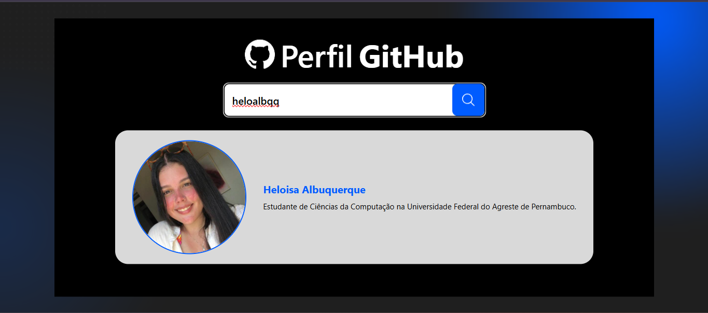

# 🔍 Desafio Avanti — GitHub Profile Search

Este projeto foi desenvolvido como parte do desafio técnico do programa da Avanti.

A aplicação permite buscar usuários do GitHub e exibir suas informações, seguindo o layout proposto no Figma.

---

## 🎨 Layout (Figma)

[🔗 Acessar protótipo no Figma](https://www.figma.com/proto/DqtFxC6312M32mLt8FpJjq/innovation-class?page-id=22%3A2864&node-id=22-3959&viewport=359%2C115%2C0.25&t=SHsEqEgaMrXGMKwv-1&scaling=scale-down-width&content-scaling=fixed&starting-point-node-id=22%3A3959&show-proto-sidebar=1
)

---

## 📸 Preview



---

## 🚀 Tecnologias utilizadas

* React
* TypeScript
* Vite
* TailwindCSS

---

## ⚙️ Funcionalidades

* 🔎 Busca de usuário do GitHub
* 👤 Exibição de avatar, nome e bio
* ⏳ Loading durante a requisição
* ❌ Mensagem de erro para usuário não encontrado

---

## 💻 Como rodar o projeto

```bash
git clone https://github.com/heloalbqq/avanti-perfil-busca.git
cd perfil-busca
npm install
npm run dev
```

---

## 👩‍💻 Desenvolvido por

Heloisa Albuquerque
